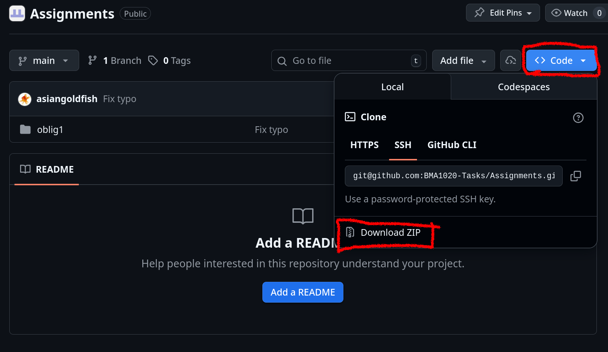

# BMA1020 Assignments

This is a repository for assignments in [BMA1020 - Mathematics for Programming](https://www.ntnu.edu/studies/courses/BMA1020#tab=omEmnet). It is a living project, meaning it will be updated as new assignments are made available, and corrections are made if errors are found.

## Download
You can download this repository using `git` or with GitHub's web interface.

*Web interface*:

Press the `Code` button, and thereafter the `Download ZIP` button.



Then, extract the archive file. You can use tools like Windows File Explorer's built-in extraction tool or 7zip to extract the file.

*Git*:
1. Download Git (https://git-scm.com/ or using your package manager of choice, e.g. choco, winget, apt, pacman).
2. Use the following command in a preferred file location on your system:
  ```
  git clone https://github.com/BMA1020-Tasks/Assignments.git
  ```

## Updating the Project
As new assignments are made available or corrections are made, this repository will be updated. You can get the latest version by downloading the repository as a ZIP archive file, or by using `git`.

*Web interface*:

Follow the instructions from [Download](#download).

*Git*:

```
git pull
```